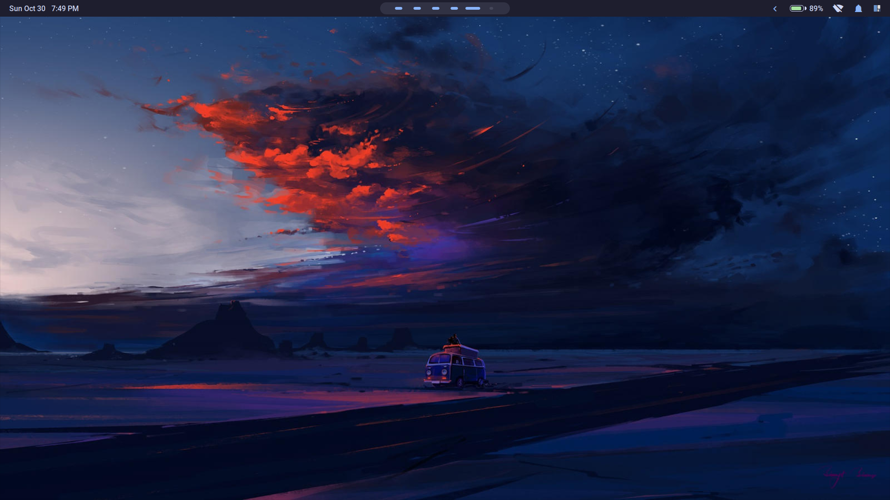
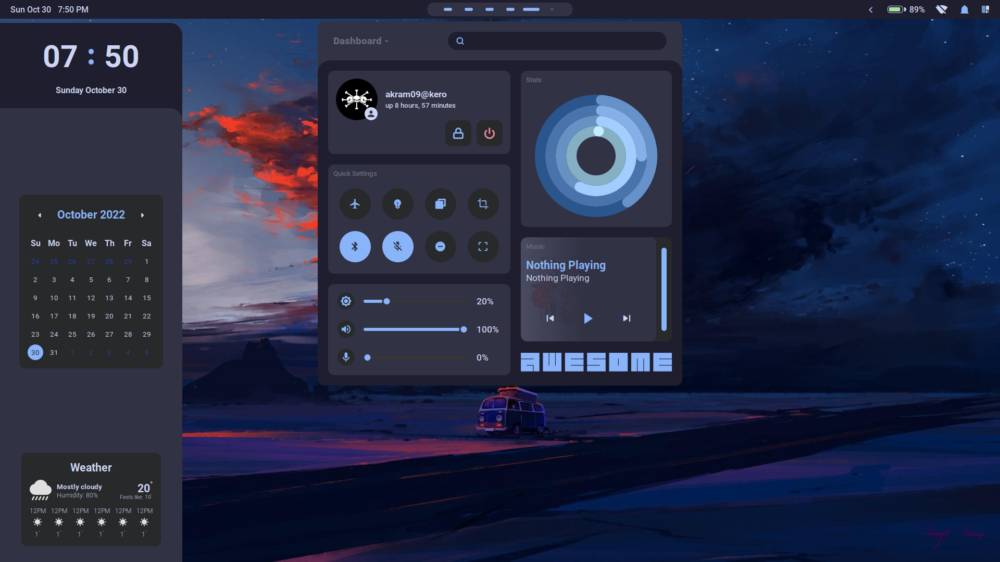
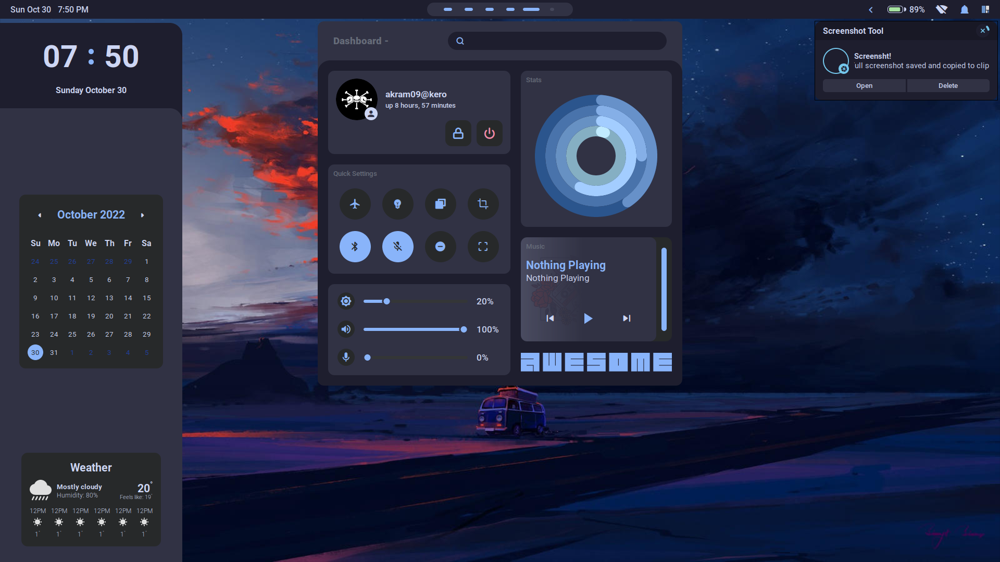
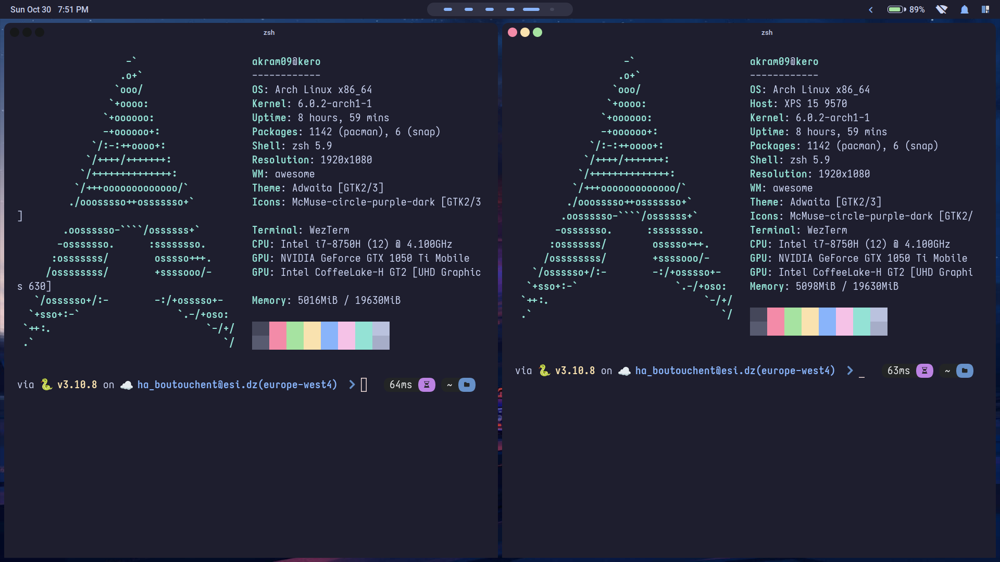
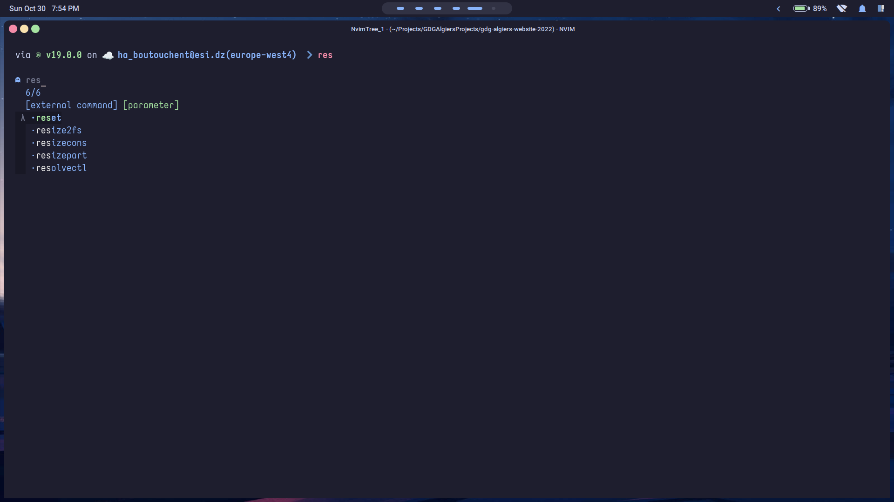
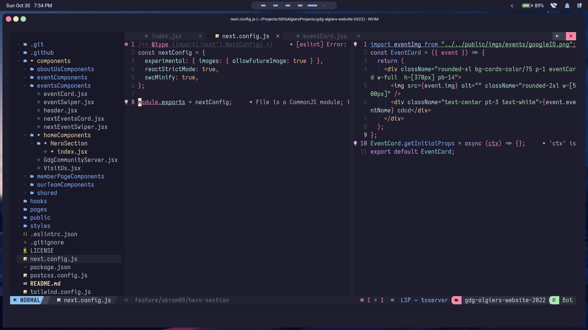
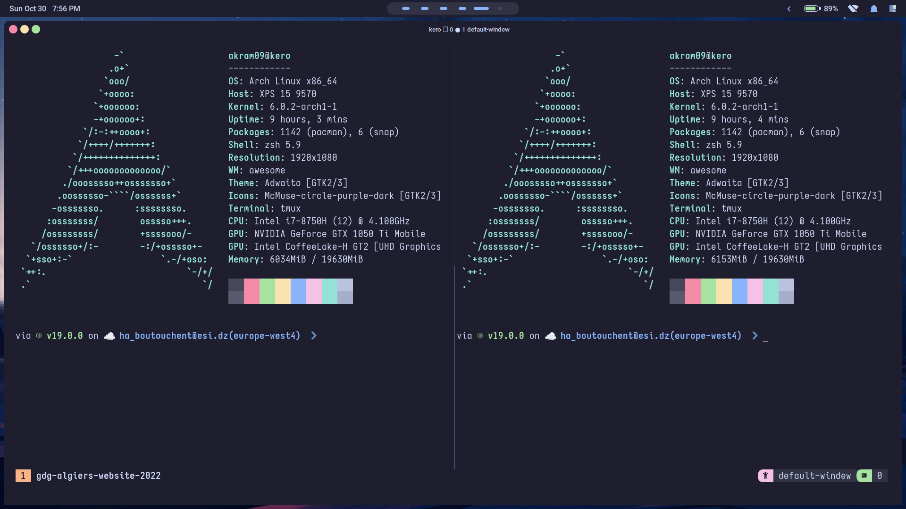

## What is ? 
The following repository encapsulates my current desktop configurations, it includes configurations for `AwesomeWM` as my windows manager, `starship` and `zsh` ash my shell, it also includes my customization of the `NvChad` vim configuration and `tmux` config. 

## Screenshots 
### Awesome Window Manager 
- Main View 

- Tiling Window manager 

- Notifications with Dunst

### Shell 
- Shell prompt with starship 

- ZSH config 

- VIM (NvChad)

- Tmux 

## Credits 
- [yoru](https://github.com/rxyhn/yoruhttps://github.com/rxyhn/yoru) 
- [NvChad](https://github.com/NvChad/NvChad/)
- [Catppuccin theme](https://github.com/catppuccin/catppuccin)
- [Tmux.conf](https://github.com/gpakosz/.tmux)

